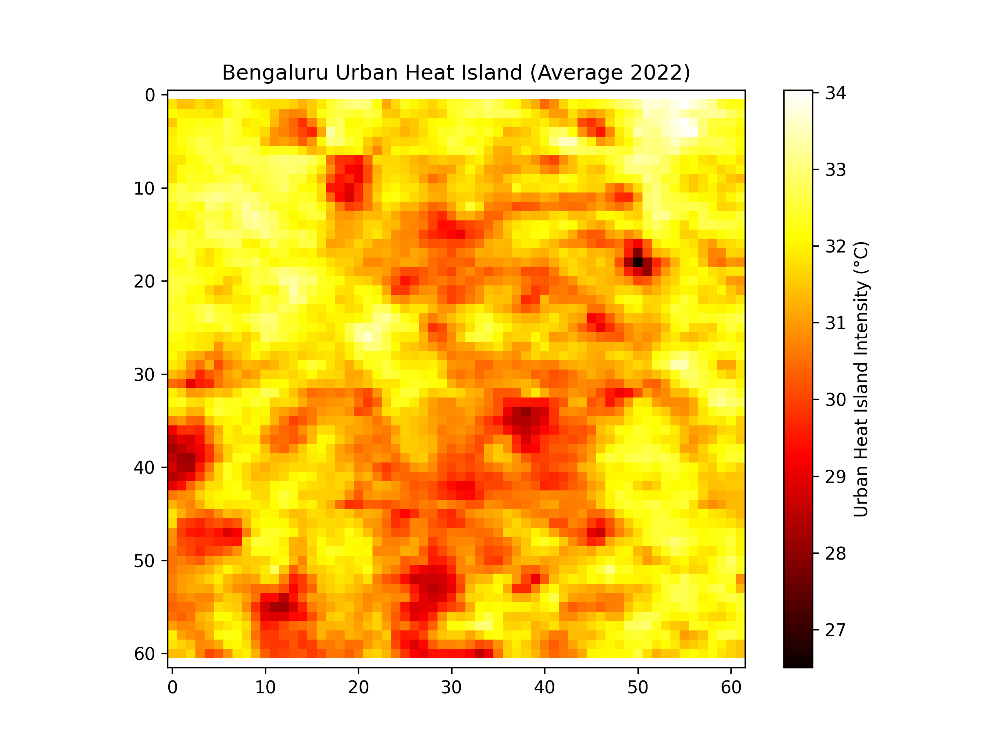

# Urban Heat Island (UHI) Analysis - Bengaluru (2022)

## 📌 Project Overview
This project analyzes the **Urban Heat Island (UHI) effect** for Bengaluru city using satellite-derived **Land Surface Temperature (LST)** data from MODIS. The project demonstrates how to:
- Fetch temperature raster data using **Google Earth Engine (GEE)**.
- Export GeoTIFF for offline analysis.
- Process and visualize UHI intensity using **Python (Rasterio, Matplotlib, NumPy)**.

---

## 🗂 Data Source
- **Dataset:** MODIS/006/MOD11A1 (Land Surface Temperature - Daytime)
- **Year:** 2022
- **Spatial Resolution:** 1 km
- **Region of Interest:** 30 km bounding box around Bengaluru, India.

> **Note:** This analysis uses a **rectangular bounding box (30 km buffer)** around Bengaluru instead of official administrative boundaries. Future improvements can include precise shapefile-based masking for higher accuracy.

---

## 🚀 Workflow
### 1️⃣ Data Collection (Google Earth Engine)
- Script (`UHI_Bengaluru_2022.js`) loads daily LST data for 2022.
- Filters images by location and time.
- Computes yearly average temperature (converted to °C).
- Exports raster data (`GeoTIFF`) to Google Drive.

### 2️⃣ Data Processing & Visualization (Python)
- Script (`uhi_analysis.py`) reads GeoTIFF.
- Masks no-data values.
- Plots a heatmap of UHI intensity.
- Computes basic statistics: **mean, min, max temperature**.

---

## 📦 Folder Structure
```
urban-heat-island-gis/
│
├── README.md                  # Project documentation
├── requirements.txt           # Python dependencies
├── UHI_Bengaluru_2022.js      # GEE script for data export
├── uhi_analysis.py            # Python script for analysis
├── sample_output_map.png      # Example UHI heatmap
└── data_instructions.txt      # How to access/download dataset
```

---

## ⚙️ Installation
```bash
pip install rasterio matplotlib numpy
```

---

## ▶️ Usage
### Step 1: Fetch Data from GEE
1. Open `UHI_Bengaluru_2022.js` in [Google Earth Engine Code Editor](https://code.earthengine.google.com/).
2. Click **Run** → Go to **Tasks** → Run the Export task.
3. Download the generated `GeoTIFF` from Google Drive.

### Step 2: Analyze Data in Python
1. Place the `.tif` file in the project folder.
2. Run:
```bash
python uhi_analysis.py
```
3. The script will:
   - Display a heatmap of UHI intensity.
   - Print mean, min, max temperatures.

---

## 📝 Sample Output


---

## 📜 License
© 2025 [Ramya MB]. This project is open-source for learning and demonstration purposes. Please provide proper credit if you reuse this code.
